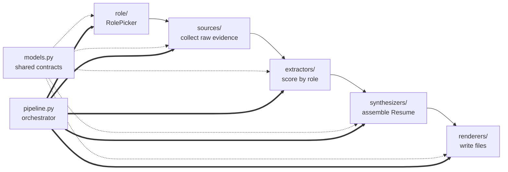
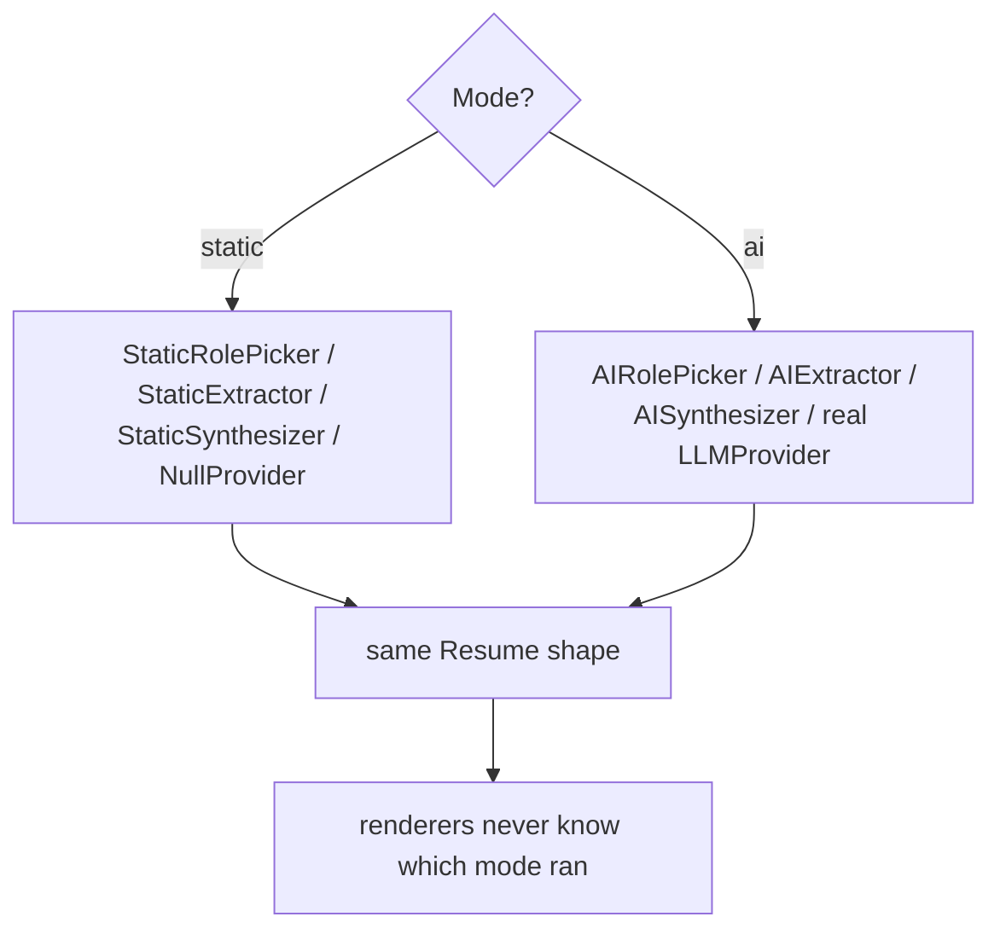

# `resume_builder` — package overview

The whole application lives here. It's a **5-stage pipeline** where every stage has two
interchangeable implementations (`static` = offline/regex, `ai` = LLM-driven) behind one
interface. The orchestrator (`pipeline.py`) is the only code that knows which mode is running.

> 📖 Architecture & team ownership: [`docs/departments/`](../../docs/departments/README.md)

## Core principle

> **One person, many roles — one truth, many resumes.** Collect everything true about a
> candidate, then *chop* it down to a single target role so only relevant evidence survives.

## The pipeline

## Folder map

| Folder / file | Responsibility | Department |
|---|---|---|
| `models.py` | Canonical pydantic contracts shared by all stages (the constitution) | 01 |
| `pipeline.py` | Orchestrator; the only mode-aware code | 01 |
| `config.py` / `principles.py` | Settings, paths, Harvard resume principles | 01 |
| `cli.py` | `resume-build` Typer entrypoint | 01 |
| [`role/`](role/README.md) | Pick a `RoleSpec` from an id or a prompt | 01 |
| [`sources/`](sources/README.md) | Pull raw evidence (GitHub, docs, social) | 02 |
| [`extractors/`](extractors/README.md) | Score/filter repos by role → `Evidence` | 03 |
| [`synthesizers/`](synthesizers/README.md) | Assemble inputs → `Resume` | 03 |
| [`llm/`](llm/README.md) | Provider-agnostic LLM interface | 03 |
| [`renderers/`](renderers/README.md) | `Resume` → files (LaTeX/PDF/HTML/MD/JSON) | 04 |
| [`web/`](web/README.md) | FastAPI "CareerLens" prototype | 05 |
| [`commands/`](commands/README.md) | CLI subcommands (auth, scrape) | 01 |
| `review_orchestrator.py` | LLM audit/review of a resume | 03 |

## Two modes

